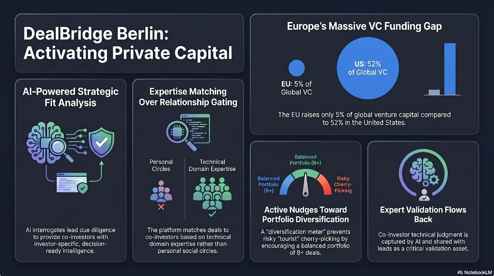
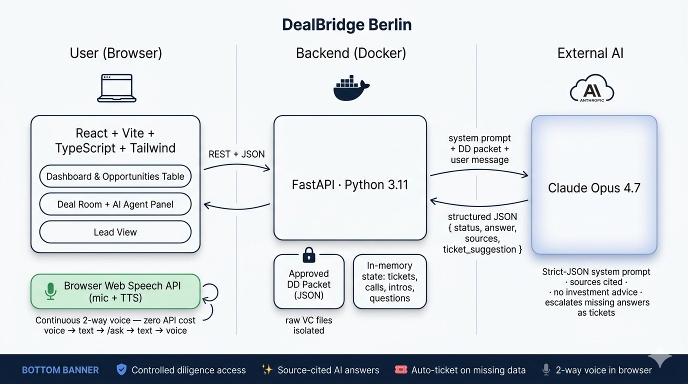

# DealBridge Berlin

Co-investment intelligence platform for strategic co-investors evaluating early-stage rounds led by credible VCs. The investor can browse matched deals, ask a controlled-access AI agent questions against an approved diligence packet, escalate gaps as VC clarification tickets, run a simulated Voice AI call, and request an intro to the lead. Raw VC files are never exposed.

Hackathon MVP — built in a single 2h30 sprint. Full build plan: [`plan.md`](./plan.md).

## Highlights

- **AI deal agent** grounded in an approved diligence packet — answers with source citations, refuses investment advice, never exposes raw VC files.
- **Ticket escalation** when the agent cannot answer from the packet.
- **Continuous two-way voice chat** with a premium listening overlay: frequency-reactive bars driven by live mic audio, volume-driven aura, and a live transcript caption. After the agent finishes replying, the mic re-opens automatically — no clicks needed until you end the conversation. Zero extra API keys (Chrome / Edge only).
- **Dashboard** with top-5 matched deals and an **Opportunities** table view of all 10.
- **Voice AI call** with a canned summary + unresolved-items list.
- **Lead view** aggregating questions, tickets, call summary, and intro request.

## Quick start — one command (Docker Compose)

```bash
docker compose up --build
```

That builds and starts both services with hot reload:

- Backend (FastAPI) on http://localhost:8000 — Swagger UI at `/docs`
- Frontend (Vite + React) on http://localhost:5173

Before the first run, create `backend/.env` from the template and add your Anthropic API key:

```bash
cp backend/.env.example backend/.env
# then edit backend/.env and set ANTHROPIC_API_KEY=sk-ant-...
```

Stop everything:

```bash
docker compose down
```

Rebuild after dependency changes:

```bash
docker compose up --build --force-recreate
```

## Architecture

Two views of the system design — pick whichever fits the slide:





Browser ⇄ FastAPI ⇄ Claude Opus 4.7. Hardcoded JSON + in-memory state on the backend. Voice runs entirely in the browser via Web Speech APIs — no extra services, no extra API keys.

## Stack

- **Backend:** Python 3.11+, FastAPI, Anthropic SDK (Claude Opus 4.7). Hardcoded JSON + in-memory state. No database.
- **Frontend:** React 19 + Vite 8 + TypeScript + Tailwind 4 + pnpm.

## Alternative ways to run

### Run the backend alone (no Docker)

```powershell
cd backend
python -m venv .venv
.\.venv\Scripts\python.exe -m pip install -r requirements.txt
copy .env.example .env   # then put your ANTHROPIC_API_KEY in .env
.\.venv\Scripts\python.exe -m uvicorn main:app --reload --port 8000
```

Linux/macOS equivalent:

```bash
cd backend
python3 -m venv .venv
source .venv/bin/activate
pip install -r requirements.txt
cp .env.example .env   # then edit .env
uvicorn main:app --reload --port 8000
```

### Run the frontend alone (no Docker)

```bash
cd frontend
pnpm install
pnpm run dev
```

Vite serves on http://localhost:5173 by default.

The frontend ships with `USE_MOCKS=true` so it runs standalone without a backend. To hit the live backend instead, create `frontend/.env.local` with:

```
VITE_USE_MOCKS=false
VITE_API_BASE_URL=http://localhost:8000
```

(Docker Compose sets these automatically.)

### Run only one service in Docker

```bash
docker compose up --build backend
docker compose up --build frontend
```

### Build a single image manually

```bash
docker build -t dealbridge-backend ./backend
docker run --rm -p 8000:8000 --env-file ./backend/.env dealbridge-backend

docker build -t dealbridge-frontend ./frontend
docker run --rm -p 5173:5173 dealbridge-frontend
```

## Environment

`backend/.env` (gitignored):

```
ANTHROPIC_API_KEY=sk-ant-...
```

Without the key, every endpoint works except `POST /api/deals/{id}/ask`, which returns `503`.

## API summary

All deal-scoped endpoints accept `deal_id = "routepilot"`. Any other id returns `404`.

| Method | Path | Purpose |
|---|---|---|
| GET | `/health` | Liveness check |
| GET | `/api/investor` | Hardcoded co-investor persona |
| GET | `/api/deals` | List of 2–3 deal cards |
| GET | `/api/deals/{id}` | Full deal detail |
| POST | `/api/deals/{id}/ask` | Text agent Q&A → `answered` or `missing_answer` |
| POST | `/api/deals/{id}/ticket` | Create VC clarification ticket |
| GET | `/api/deals/{id}/tickets` | List tickets for a deal |
| POST | `/api/deals/{id}/voice-call` | Simulated Voice AI call summary |
| POST | `/api/deals/{id}/intro-request` | Submit intro request to lead |
| GET | `/api/lead-view/{id}` | Lead-side aggregate: investor, questions, tickets, call, intro |

### `/ask` response shape

```json
{
  "status": "answered" | "missing_answer",
  "answer": "...",
  "sources": [{ "label": "Round details", "section": "round" }],
  "ticket_suggestion": null | { "question": "...", "category": "..." },
  "next_actions": ["ask_follow_up", "start_voice_call", "create_ticket", "request_intro", "decline"]
}
```

When `status = "answered"`, `sources` is non-empty and `ticket_suggestion` is `null`. When `status = "missing_answer"`, `sources` is empty and `ticket_suggestion` is set. The agent will never give investment advice or expose raw VC files.

## Smoke test

With the server running and a valid key in `backend/.env`:

```powershell
cd backend
powershell -ExecutionPolicy Bypass -File .\smoke_test.ps1
```

Hits all 9 endpoints in demo order and prints the status of each.

## Repository layout

```
.
├── docker-compose.yml       Boot both services with one command
├── backend/
│   ├── Dockerfile
│   ├── main.py              FastAPI app + all endpoints
│   ├── data/                Hardcoded JSON fixtures
│   ├── requirements.txt
│   ├── smoke_test.ps1
│   └── .env.example
├── frontend/
│   ├── Dockerfile
│   ├── package.json
│   ├── vite.config.ts
│   └── src/
└── plan.md                  Frozen build plan
```

## What is intentionally NOT in this MVP

- No database (hardcoded JSON, in-memory state for the demo session).
- No LangChain / LangGraph (single-turn Q&A against one packet — direct SDK call is simpler).
- No expert-validation flow, portfolio meter, or VC syndication analytics (deferred to post-hackathon).

Reasoning in [`plan.md`](./plan.md) §1 and §2.
